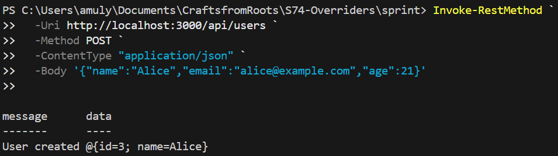
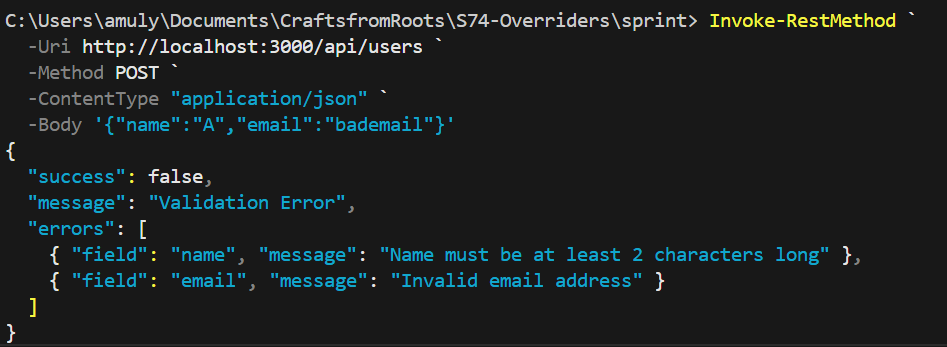

# CraftsfromRoots 

A fair-trade digital marketplace that connects **tribal and rural artists directly with global buyers**, eliminating middlemen while preserving authenticity, culture, and fair pricing.

---

##  Project Goal

To build a working online platform that enables tribal and rural artists to:

* Sell their artwork directly to buyers worldwide
* Receive fair compensation for their craft
* Preserve cultural authenticity through verified artist profiles

And enables buyers to:

* Discover authentic handmade art
* Purchase directly from the creator
* Learn the story and roots behind each artwork

---

## 4-Week Development Roadmap

### Week 1 – Planning & Foundation

**Focus:** Understanding requirements and setting a strong base.

**Activities:**

* Identify needs of artists and buyers
* Finalize MVP features
* Create GitHub repository and project structure
* Design wireframes and database schema
* Decide artwork categories
* Distribute tasks among team members

**Outcome:**
A fully initialized project with a clear technical and design plan.

---

###  Week 2 – Core Development

**Focus:** Building the core system.

**Activities:**

* User authentication (signup & login)
* Artist profile creation
* Backend APIs for artwork management
* Frontend pages (landing page, dashboards, forms)
* Upload sample artworks for testing

**Outcome:**
Artists can register and list artworks on the platform.

---

###  Week 3 – Integration & Testing

**Focus:** Connecting components and ensuring reliability.

**Activities:**

* Frontend–backend API integration
* Validation and error handling
* API testing using Bruno/Postman
* CI/CD pipeline setup
* Deployment environment preparation

**Outcome:**
Smooth user flow from login to artwork browsing.

---

###  Week 4 – Finalization & Deployment

**Focus:** Polishing and releasing the MVP.

**Activities:**

* Freeze MVP features
* Fix remaining bugs
* Improve UI and performance
* End-to-end testing
* Write documentation (README & API docs)
* Deploy frontend and backend

**Outcome:**
A demo-ready marketplace live on the internet.

---

##  Measures of Success

By the end of 4 weeks:

* Verified artist accounts are active
* Artworks are uploaded and browsable
* Buyers can place orders directly
* Application is securely deployed
* All planned MVP features are completed

---

##  Technical Insight

###  How does choosing between static, dynamic, and hybrid rendering affect performance, scalability, and data freshness in a Next.js application?

Next.js provides **three rendering strategies**, each with trade-offs:

####  Static Rendering (SSG – Static Site Generation)

* Pages are generated at build time
* Extremely fast load times (served via CDN)
* Highly scalable with minimal server cost
* Data does **not update** unless the site is rebuilt

**Best for:**

* Landing pages
* About pages
* Static content like platform vision

---

####  Dynamic Rendering (SSR – Server-Side Rendering)

* Pages are generated on every request
* Always shows the **latest data**
* Slower than static pages
* Higher server load, less scalable

**Best for:**

* User dashboards
* Order history
* Personalized content

---

####  Hybrid Rendering (SSG + SSR + ISR)

* Combines static and dynamic approaches
* Uses **Incremental Static Regeneration (ISR)** to update data periodically
* Balances performance and freshness
* More flexible and scalable

**Best for:**

* Artwork listings
* Artist profile pages
* Marketplaces like CraftsfromRoots

---

###  Why Hybrid Rendering is Ideal for CraftsfromRoots

* Static pages ensure fast global access
* Dynamic rendering keeps user-specific data fresh
* ISR allows artwork updates without rebuilding the entire site
* Results in **better performance, scalability, and real-time accuracy**

---

### Why is environment segregation (development, staging, production) essential in modern deployments, and how does secure secret management improve the safety and reliability of your CI/CD pipelines?

Modern applications like CraftsfromRoots, deployed using Docker, cloud platforms (AWS/Azure), and GitHub Actions, require strict separation of environments and secure handling of secrets to remain safe, stable, and scalable.

**Environment Segregation**
Environment segregation means maintaining separate development, staging, and production environments, each with its own configuration, database, and resources.
Development Environment
Used by developers for daily coding and testing
Allows experimentation and debugging
Failures here do not impact users
Staging Environment
Mirrors production as closely as possible
Used for final testing, QA, and client/demo validation
Catches bugs before real users are affected
Production Environment
Live system used by real users
Must be stable, secure, and monitored
Changes are deployed only after validation
 Why It Is Essential
Prevents unfinished or broken features from reaching users
Protects production data from accidental corruption
Enables safe testing of new releases
Improves reliability and confidence in deployments

**Secure Secret Management in CI/CD Pipelines**

Secrets include:
Database credentials
API keys
JWT secrets
Redis passwords
Cloud access tokens
Risks Without Secure Management
Secrets hardcoded in repositories can be leaked
Compromised credentials can expose databases and servers
Builds may fail or behave unpredictably across environments
Secure Practices Used
Secrets stored in GitHub Actions Secrets or cloud secret managers
Different secrets for dev, staging, and production
Environment variables injected at runtime
Secrets never committed to version control

**Benefits to CI/CD Pipelines**

Prevents unauthorized access even if code is exposed
Ensures consistent and reproducible builds
Allows safe automation of deployments
Enables quick secret rotation without code changes


---

## Database Schema Design

### Core Entities

* **User**: Registered user of the application.
* **Project**: Created and owned by a user.
* **Task**: Individual task under a project.

### Prisma Schema

```prisma
model User {
  id        Int      @id @default(autoincrement())
  email     String   @unique
  name      String
  projects  Project[]
}

model Project {
  id      Int     @id @default(autoincrement())
  title   String
  userId  Int
  user    User    @relation(fields: [userId], references: [id], onDelete: Cascade)
  tasks   Task[]

  @@index([userId])
}

model Task {
  id        Int     @id @default(autoincrement())
  title     String
  completed Boolean @default(false)
  projectId Int
  project   Project @relation(fields: [projectId], references: [id], onDelete: Cascade)

  @@index([projectId])
}
```

### Relationships & Constraints

* One User → Many Projects
* One Project → Many Tasks
* Foreign keys enforce referential integrity
* `ON DELETE CASCADE` prevents orphan records
* Unique constraint on user email
* Indexed foreign keys improve query performance

### Normalization

The schema follows **3NF**, avoiding redundancy and ensuring all non-key attributes depend only on their primary keys.

### Migrations

Tables were created using Prisma migrations:

```bash
npx prisma migrate dev --name init_schema
```

Seed data was added to validate relationships.

---

# Input Validation with Zod

Zod schemas were implemented for validating POST and PUT API routes to ensure incoming data is correctly typed and complete before processing. Validation logic is centralized inside reusable schema files under lib/schemas, enabling reuse across server routes and client forms.

Invalid requests return structured error responses with field-level messages, improving API reliability and developer experience. This approach prevents malformed data from reaching the database and enforces consistent data contracts across the application.





---

# Centralized Error Handling

This project uses a centralized error handler to ensure all API errors are handled consistently. Validation and runtime errors are logged in a structured format for easier debugging while returning safe, user-friendly responses to the client. In development mode, detailed error information is available for debugging, whereas in production only generic messages are exposed to avoid leaking sensitive details. This improves reliability, security, and developer efficiency as the application scales.

---

## Role-Based Access Control (RBAC)

### Roles & Permissions

| Role   | Permissions                    |
|------- |--------------------------------|
| Admin  | create, read, update, delete   |
| Editor | read, update                   |
| Viewer | read                            |

### Access Evaluation Logic
- User role is derived from session/JWT (mocked for this task)
- Every API action checks permission before execution
- Unauthorized access returns HTTP 403
- All allow/deny decisions are logged

### Audit Logs
Example:
[RBAC] EDITOR tried CREATE: DENIED  
[RBAC] ADMIN tried DELETE: ALLOWED  

### Reflection
This RBAC system centralizes authorization logic, making it scalable and auditable.
It can evolve into policy-based access control (PBAC) by introducing contextual
rules such as resource ownership, time-based access, or attribute-based policies.


---

Authentication Flow

User signs up → password hashed with bcrypt

User logs in → password verified → JWT issued

JWT sent in Authorization header to access protected routes

bcrypt Usage
const hash = await bcrypt.hash(password, 10);
const isValid = await bcrypt.compare(password, hash);

JWT Usage
jwt.sign({ id, email }, JWT_SECRET, { expiresIn: "1h" });
jwt.verify(token, JWT_SECRET);

Token Expiry & Refresh

Short-lived tokens reduce attack surface

Refresh tokens can be introduced for long sessions

Token rotation improves security

Token Storage

HTTP-only cookies → safest (XSS-resistant)

localStorage → simple but XSS-prone

Authorization headers → clean API separation

Security Benefits

Passwords never stored in plaintext

Stateless authentication scales horizontally

JWT enables fine-grained access control

---


# Redis Caching Integration (Next.js + Prisma)

## Overview

To improve API performance and reduce unnecessary database queries, Redis was integrated as an in-memory caching layer in this Next.js application. A cache-aside pattern was implemented, allowing frequently accessed data to be served quickly while maintaining consistency with the primary PostgreSQL database.

This approach reduces response latency for repeated requests and optimizes overall backend efficiency.

---

## Redis Setup

Redis is run locally using Docker and connected using the `ioredis` client.

### Redis Client Configuration

```ts
// app/lib/redis.ts
import Redis from "ioredis";

const redis = new Redis(process.env.REDIS_URL || "redis://localhost:6379");

export default redis;
```

---

## Caching Strategy (Cache-Aside Pattern)

The cache-aside pattern is implemented as follows:

1. Check Redis for cached data.
2. If cached data exists, return it immediately.
3. If cached data does not exist, fetch data from the database.
4. Store the fetched data in Redis with a defined TTL.
5. Return the response to the client.

This ensures that Redis remains a performance optimization layer rather than a source of truth.

---

## Cached Resource

### Resource Cached

* Endpoint: `GET /api/users`
* Data: List of users

### Rationale

* Frequently accessed endpoint
* Read-heavy workload
* Database queries are more expensive than Redis lookups
* Ideal candidate for caching

---

## API Route with Redis Caching

### Cache Read and Write Logic

```ts
// app/api/users/route.ts
import { NextResponse } from "next/server";
import prisma from "@/lib/prisma";
import redis from "@/lib/redis";

export async function GET() {
  const cacheKey = "users:list";

  const cached = await redis.get(cacheKey);
  if (cached) {
    console.log("Cache Hit");
    return NextResponse.json(JSON.parse(cached));
  }

  console.log("Cache Miss - Fetching from DB");
  const users = await prisma.user.findMany();

  await redis.set(cacheKey, JSON.stringify(users), "EX", 60);

  return NextResponse.json(users);
}
```

---

## Cache Invalidation Strategy

To prevent stale data, the cache is invalidated whenever user data is modified.

### Example Invalidation Logic

```ts
await redis.del("users:list");
```

This ensures that subsequent requests fetch fresh data from the database before repopulating the cache.

---

## TTL (Time-To-Live) Policy

* TTL Duration: 60 seconds
* Reasoning:

  * Balances performance and data freshness
  * Prevents stale data from persisting indefinitely
  * Suitable for moderately changing datasets

Redis automatically removes expired entries, reducing manual cache maintenance.

---

## Performance Comparison

### Cache Miss (Cold Request)

Command:

```bash
Invoke-RestMethod http://localhost:3000/api/users
```

Log Output:

```
Cache Miss - Fetching from DB
Response time: ~1000 ms
```

---

### Cache Hit (Warm Request)

Command:

```bash
Invoke-RestMethod http://localhost:3000/api/users
```

Log Output:

```
Cache Hit
Response time: ~10–15 ms
```

This demonstrates a significant reduction in response time for repeated requests.

---

## Cache Coherence and Data Consistency

Cache coherence is maintained through:

* Explicit cache invalidation on write operations
* Short TTL values to enforce automatic refresh
* Database-level constraints enforced by Prisma and PostgreSQL

This combination ensures consistency between cached data and persistent storage.

---

## Risks of Stale Data and Mitigation

### Potential Risks

* Cached data becoming outdated after write operations
* Multiple updates occurring within the TTL window

### Mitigation Measures

* Cache invalidation on create, update, and delete operations
* Conservative TTL duration
* Cache-aside pattern to ensure database remains the source of truth

These measures minimize the likelihood of serving stale data.

---

## Conclusion

By integrating Redis as a caching layer, the application achieves:

* Reduced API response times
* Lower database load
* Improved scalability for read-heavy workloads

This implementation reflects a production-oriented caching strategy aligned with real-world backend system design.

---


##  Tech Stack

**Frontend:** Next.js (TypeScript)

**Backend:** Next.js API Routes / Server Actions

**Database:** PostgreSQL

**ORM:** Prisma

**Caching & Sessions:** Redis

**Authentication:** JWT / Session-based Authentication

**Containerization:** Docker

**CI/CD:** GitHub Actions

**Cloud Deployment:** AWS / Azure

**Version Control:** Git & GitHub

---

##  Vision

CraftsfromRoots aims to be more than a marketplace — it is a bridge between **hands that create** and **hearts that value authenticity**.

> *From the roots of the land, to homes across the world.* 

---

## 👥 Contributors

* Team Members: *(Rithik Kumar, Mithun Krishna, Amulya B)*
* Project Duration: 4 Weeks

---